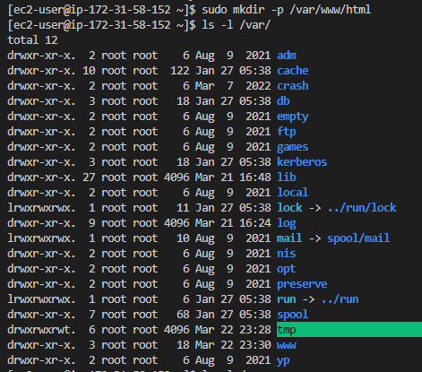
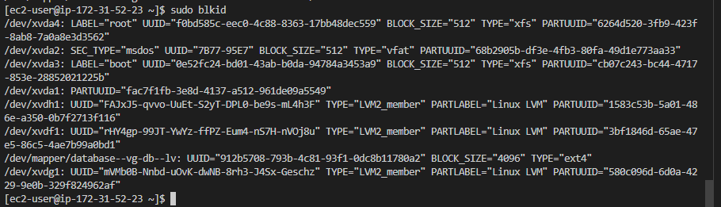
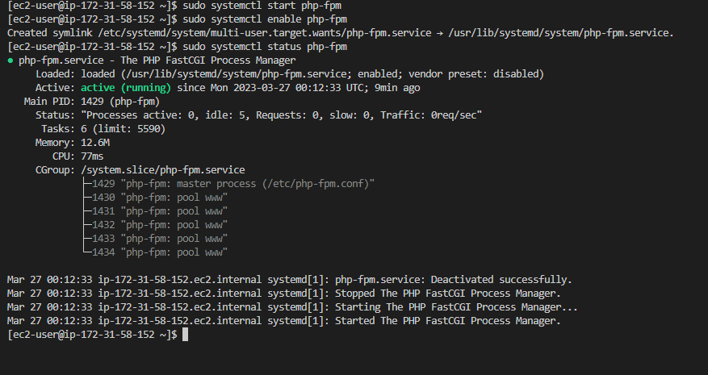
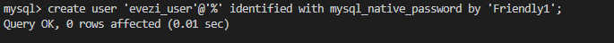

## Documentation for Project 6
## WEB SOLUTION WITH WORDPRESS

## LAUNCH AN EC2 INSTANCE THAT WILL SERVE AS “WEB SERVER”
## STEP 1 — PREPARE A WEB SERVER

-- Starting by spinning up two EC2 instance Linux OS labelled "P-6 - WordPress-Web Server" and "P-6 Mysql-Database Server"  using RedHat Linux distribution SSH from my local windows terminal.

--This project consisit of two parts
'1. Configure storage subsystem for web server and database server on Linux OS. Working Disk, Partitions and Volumes in linux' 
'2. Install wordPress and connect remotely to Mysql database server - Deploying 3 Tier web & database of web solution' 

ssh to ec2 instance for wordPress web Server

`lsblk`--(Checking inital disk present by running command in instance WordPress Web Server, display shows a default disk 'xvda' and 4 partitions 'xvda1 to xvda4' currently present)

`lsblk`--(Creating addtional three volumes in my Ec2 instaance and attaching volumes to my WordPress Web Server. Now running 'lsblk' command again, we want to inspect what block devise is attached to server (default disk of WordPress Web Server) 'xvdf, xvdg and xvdh')

`df -h`--(running command to view all mount and free available space on server)

`ls /dev`--(Running command to view all folders and devices in directory of root device been listed)

`sudo gdisk /dev/xvdf`--(using the gdisk utility to Create partition on each of the a disk within directory of root device)

`lsblk`--(using command to display shows disk 'xvdf' and 1 partition created 'xvdf1' currently present within directory of root device)

`sudo gdisk /dev/xvdg`;`sudo gdisk /dev/xvdh`--(Repeating step above to create partition for physical disk -- xvdg and xvdh)

`lsblk`--(using command to display shows disk 'xvdg, xvdh' and 1 partition created each for 'xvdg1,xvdh1' within directory of root device)

`sudo yum install -y lvm2`--(Install lvm2 pakage using redhat package manager)

`which lvm`--(To check location of LVM package Installed)

`sudo pvcreate /dev/xvdf1 /dev/xvdg1 /dev/xvdh1`--(using the pvcreate utility to mark each of the 3 disks as physical volume to be used by logical volume management)

`sudo pvs`--(Running command to confirm each of the disk partitioned are marked to be used for LVM. Each of these are individual disk are now physical volume.

`sudo vgcreate webdata-vg /dev/xvdf1 /dev/xvdg1 /dve/xvdh1`--(Using the vgcreate utility command to add all 3 physical volumes to a volume group. What this does is concantinate all 3 pv as one individual one.

`sudo lvcreate -n apps-lv -L 14G webdata-vg`; `sudo lvcreate -n logs-lv -L 14G webdata-vg`; `sudo lvs`--(Using the lvcreate utility command to create 2 logical volumes apps-lv and logs-lv allocating the PV space in the webdata-vg in two equal half. Run sudo lvs to confirm lv action was successful)

(./Image-6/WebServer-CompleteSetup-LV-15b.PNG)
(./Image-6/WebServer-CompleteSetup-PV-15c.PNG)

`lsblk`--(Final setup display; 3 physical volume in webdata-vg volume group then created 2 logical volume 'logs-lv' and 'apps-lv' with equal size space.

`sudo mkfs.ext4 /dev/webdata-vg/apps-lv`; `sudo mkfs.ext4 /dev/webdata-vg/logs-lv`--(We have created 2 devices within directory '/dev/webdata-vg/apps-lv' and '/dev/webdata-vg/logs-lv' for logical volume 'apps-lv' and 'logs-lv' added to filesystem).

`ls -l /var`--(List content within the 'var' directory, confirming if folder 'www' existent)

`sudo mkdir -p /var/www/html`--(Creating 'www' folder within the 'var' directory, as linux os would create the 'html' by default)

`sudo ls -l /var/www/html`--(Checking '/var/www/html' directory is empty, not to loss file if any)

`sudo mount /dev/webdata-vg/apps-lv /var/www/html`--(Mounting '/var/www/html'on 'app-lv' logical volume)

`sudo ls -l /var/log`--(Checking '/var/log' directory has a list of file, in other not to loss content we would be moving files to '/home/recovery/logs' which was created earlier on)

`sudo rsync -av /var/log/. /home/recovery/logs/`--(Copying all files from '/var/log' directory to '/home/recovery/logs' directory)

`sudo ls -l /home/recovery/logs/` --(Running command to check action was successful and files were copied from '/var/log' directory into current recovery folder)

`sudo ls -l /var/log/` --(Running command to check action was successful and files were copied back to '/var/log' directory)

## UPDATE THE `/ETC/FSTAB` FILE

`sudo blkid` --(Using command to check for 'blockid, 'UUID of the device to update the /etc/fstab file)

`sudo vi /etc/fstab` --(Using vi text editor to update /etc/fstab configuration file in this format using my own UUID)

`sudo mount -a` --(Run command to validate edited /etc/fstab config file was successful and returned no error)

`sudo systemctl daemon-reload`;`df -h` --(Restart system 1. To test configuration and reload the  daenom and 2. Run  seconf command to list the persistent mount device for WordPress Web Server)

## Step 2 — Prepare the Database Server

`lsblk`--(Creating addtional three volumes in my Ec2 instance and attaching volumes to my Mysql Database Server. Now running 'lsblk' command, we want to inspect what block device is attached to server (default disk of Mysql Database Server) 'xvdf, xvdg and xvdh')

`df -h`--(running command to view all mount and free available space on server)

`ls /dev`--(Running command to view all folders and devices in directory of root device been listed)

`sudo gdisk /dev/xvdf`--(using the gdisk utility to Create partition on each of the a disk within directory of root device)

`sudo gdisk /dev/xvdg`;`sudo gdisk /dev/xvdh`--(Repeating step above to create partition for physical disk -- xvdg and xvdh)

`lsblk`--(using command to display shows disk 'xvdf, xvdg, xvdh' and 1 partition created each for 'xvdf1, xvdg1, xvdh1' within directory of root device)

`sudo yum install -y lvm2`--(Install lvm2 pakage using redhat package manager)

`sudo pvcreate /dev/xvdf1 /dev/xvdg1 /dev/xvdh1`--(using the pvcreate utility to mark each of the 3 disks as physical volume to be used by logical volume management)

`sudo pvs`--(Running command to confirm each of the disk partitioned are marked to be used for LVM. Each of these are individual disk are now physical volume.

`sudo lvcreate -n db-lv -L 20G database-vg`;`sudo lvs`--(Using the lvcreate utility command to create a logical volumes db-lv allocating the PV space to 20G in the database-vg. Run sudo lvs to confirm lv action was successful)

(./Image-6/DbServer-CompleteSetup-LV-12b.PNG)
(.Image-6/DbServer-CompleteSetup-PV-12c.PNG)

`lsblk`--(Final setup display; 3 physical volume in webdata-vg volume group then created 2 logical volume 'logs-lv' and 'apps-lv' with equal size space.
.

`sudo mount /dev/database-vg/db-lv /db`--(Mounting '/dev/database-vg/db-lv' on 'db-lv' logical volume)

`df -h`--(Confirming Mounted '/dev/database-vg/db-lv' on 'db-lv' was successful and is displayed)

## UPDATE THE `/ETC/FSTAB` FILE

`sudo blkid` --(Using command to check for 'blockid, 'UUID of the device to update the /etc/fstab file)

`sudo vi /etc/fstab` --(Using vi text editor to update /etc/fstab configuration file in this format using my own UUID)

`sudo mount -a` --(Run command to validate edited /etc/fstab config file was successful and returned no error)

`sudo systemctl daemon-reload`;`df -h` --(Restart system 1. To test configuration and reload the daenom and 2. Run second command to list the persistent mount device for dataWeb Server)

## Step 3 — Install WordPress on your Web Server EC2

`sudo yum update -y` --(Run command for both Web server and Database server terminals to update system, using yum package manager for Redhat linux distribution)

## Install wget, Apache and it’s dependencies

`sudo yum install wget httpd php php-mysqlnd php-fpm php-json -y` --(Run command to install software for Wget, Apache, Php and it's dependecies to Web server terminals It was observed rhel-9 repository  was installed instead of rhel-8)

`sudo systemctl start httpd`;`sudo systemctl enable httpd`and`sudo systemctl status httpd` --(Running Command to start, enable and show status of Apache - Httpd is Active and running)

## To install PHP and it’s depemdencies

`subscription-manager repos --enable codeready-builder-for-rhel-9-$(arch)-rpms` --(Enable codeready builder repository for our RHEL system by utilizing subscription-manager)

`sudo dnf install https://dl.fedoraproject.org/pub/epel/epel-release-latest-9.noarch.rpm -y` --(Install Epel rhel-9 repository. To install latest version of PHP as prior knowlegde Wordpress would only work with latest configuration of PHP especially Redhat enterprise Linux)

`sudo dnf install https://dl.fedoraproject.org/pub/epel/epel-release-latest-9.noarch.rpm -y` --(Install Remi rhel-9 repository)

`sudo dnf module list php` --(List PHP modules we may wish to install)

`sudo dnf module reset php`;`php -v` --(Reset PHP modules and confirming PHP version installed)

`sudo yum install php php-opcache php-gd php-curl php-mysqlnd` --(Install PHP, PHP-pfm 'fastcgi' and associate PHP modules)

`sudo systemctl start php-fpm` --(This command is to start the system, after which we enable the php fastcgi. Also confirming php-fpm is active and running by checking system status)

`sudo setsebool -p httpd_execmem 1` --(This command is to redhat policies on directories and files)(Input public IP Address in the web browser to display Redhat test page)

## Download wordpress and copy wordpress to 'var/www/html'

`mkdir wordpress && cd wordpress`; `sudo wget http://wordpress.org/latest.tar.gz` --(This command is to create a directory 'wordpress' change directory and install wordpress software in wordpress directory)

`sudo tar xzvf latest.tar.gz` --(This command is to extract 'wordpress' software within wordpress directory, we can see another wordpress folder is created in worpress directory)

`cd wordpress/`;`ls -l` --(Change directory into new  'wordpress' folder  within wordpress directory, this is were configuration occurs. list content of current working directoty)

`sudo cp -R wp-config-sample.php wp-config.php`;`ls -l` --(we have successfully copied recursively the 'wp-config-sample.php' file into newly created 'wp-config.php' file - this would do editing of configuration file)

`sudo cp -R wordpress/. /var/www/html/`;`ls -l` --(we have successfully copied recursively the entire 'worpress' folder into directory '/var/www/html/'.Change directory into /var/www/html to confirm content)

## Step 4 — Install MySQL on your DB Server EC2

`sudo yum install -y mysql-server`;`sudo systemctl status mysqld` --(Successfully installed mysql-server on both wer server and database server and confirm that mysql is active and running)

`sudo mysql_secure_installation` --( Running command to Install securities for mysql)

`mysql -u root -p` --(login to mysql shell, given prompt to provide password)

`create user 'evezi_user'@'%' identified with mysql_native_password by 'Friendly1';` --(Create user and password for my database, given prompt to provide password)

`create databases evezi_db`; `show databases` --(Create user and password for my database, given prompt to provide password)

`grant all on evezi_db.* to 'evezi_user'@'%' with grant option;`; `Flush privileges;` --(Grant all privileges on the database to the specified user at all trafic at specific IP address)

`select user, host from msql.user;` --(Check if our user has been created)

`sudo vi /etc/my.cnf` --(Using vi text editor to edit /et/my.cnf cofiguration file with bind address set it to '0.0.0.0' - IP address is open to all traffic)

`sudo vi wp-config.php` --(Back to web server terminal still in the  '/var/www/html' directory, Using vi text editor to edit 'wp-config.php' cofiguration file. Editing database_name, user_name, Password and Local_Host with private IP address as web server and database server reside in the same subnet. both IP address can talk to each other)

`sudo mv /etc/httpd/conf.d/welcome.conf /etc/httpd/conf.d/welcome.conf_backup` --(Rename our default apache home page or welcome page)

`sudo mysql -h 172.31.52.23 -u evezi_user -p`; `Show databases;` --(Connection established 1.login remotely from wordpress web server  terminal to database server using the private IP address for the database server. 2. Perform a task in the database) Change permissions and configuration so Apache could use WordPress:

`sudo chown -R apache:apache /var/www/html/`--(change permission and configuration so Apache can use wordpress) 

`sudo chcon -t httpd_sys_rw_content_t /var/www/html/ -R`--(Policy for Redhat directory)
`sudo setsebool -P httpd_can_network_connect=1` --(Policy for Redhat Files) 
`sudo setsebool -P httpd_can_network_connect_db 1` --(Policy for Redhat Db) 

`http://54.158.223.209;` --(Inserting my Public IP address for web server in browswe, Wordpress ome page with my credential login) 

(./Image-6/Configuaration-FirstPost-Wordpress-5.PNG)

